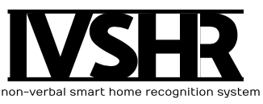

# Non-Verbal Smart Home Recognition (NVSHR) System 

### Environment Set-Up

 If you are using a Windows machine, please check and make sure you are using the current SDK files.
 You can most likely find these files in your C directory (C:\Program Files (x86)\Microsoft SDKs\Windows Kits) or similar directory.
 If the SDKs are missing, you can download them from the official Windows website (https://developer.microsoft.com/en-us/windows/downloads/windows-10-sdk) or install the tool kits via Visual Studio Installer.
 *An example image is stored here (https://github.com/codieorberson/NVSHR/blob/master/src/pics/SDKs.png).*
 
 For Windows machines, please follow these steps to set up your environment for the NVSHR System:

1. Install Python3.7 (https://www.python.org/downloads/)

2. Once Python3.7 has finished downloading, open a command prompt and install the packages needed for this project by running the following commands:
   + `pip install numpy`
   + `pip install opencv-python`
   + `pip install Cmake`
   + `pip install scipy`
   + `pip install Pillow`
   + `pip install TPLink`
   + `pip install playsound`
   + `pip install pyHS100`
   
   These libraries are needed for the NVSHR System to properly run on your machine. 
    
 For Mac machines, please follow these steps to set up your environment for the NVSHR System:

1. Install Homebrew (https://docs.brew.sh/Installation)

2. Once Homebrew is finished installing, please run the following commands to download the latest version of Python and pip:
   + `brew install python`
   + `sudo easy_install pip`

3. Once Python and pip have finished downloading, open a command prompt and install the packages needed for this project by running the following commands:
   + `pip install numpy`
   + `pip install opencv-python`
   + `pip install Cmake`
   + `pip install scipy`
   + `pip install Pillow`
   + `pip install TPLink`
   + `pip install playsound`
   + `pip install pyHS100`
   
   These libraries are needed for the NVSHR System to properly run on your machine. 

### Initializing the NVSHR System

Follow these steps to initialize the NVSHR system on your device: 

1. Run `python3 main.py`. 

2. After running the previous command, a pop-up window will appear verifying what type of user you are. 
    
    a. If you are an administrator for the system, the administrator GUI will appear for system configuration. Please follow all instructions on within the system to ensure the user will have the easiest experience with the system. Once configuration is completed simply navigate back to the 'Instruction' tab and press 'Close Administrator Window' to prepare the system for normal users.   
    
